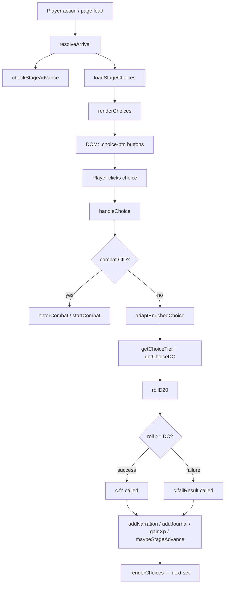
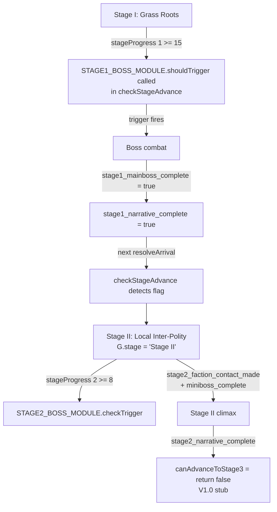
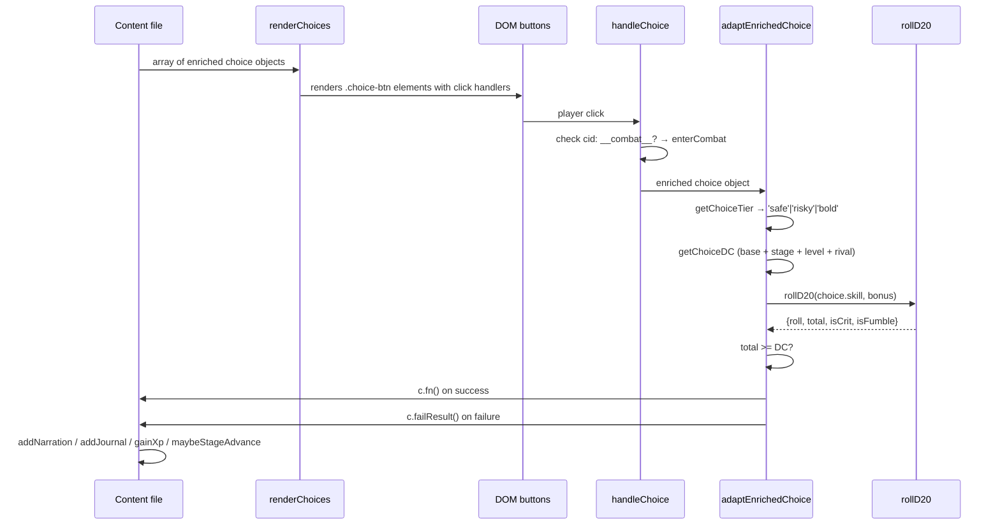

# Ledger of Ash — Engine Architecture Reference

> Developer reference for extending `ledger-of-ash.html`. All source references use line numbers as of June 2026. The entire engine is a single 18,000-line HTML file; all JS executes in one module scope.

---

## 1. Architecture Overview



**Key architectural facts:**

- The engine is a single HTML file. All JS shares one scope — function name collisions silently shadow each other. Always `grep` before naming a new function.
- `let G` is declared at module scope (~line 9725). `window.G` is `undefined`. Never use `var G = window.G` as a local alias.
- Content scripts in `content/` are loaded via `<script src="content/filename.js">` tags near lines 18220–18322. There is no auto-discovery — a missing tag means the file silently does not load.
- `adaptEnrichedChoice` wraps every enriched choice `fn()` in a `try/catch` that swallows errors. A TypeError from a missing G property will log to `console.error` but show the player "Something went wrong. Continuing..." and reload choices 800ms later. This is the #1 source of silent failures.

---

## 2. Game State (G Object)

`G` is initialized at ~line 9725. Every property read in content or engine logic must exist in the defaults object — missing keys cause silently swallowed errors.

### Core Identity

| Field | Type | Default | Description |
|---|---|---|---|
| `name` | string | `''` | Player-chosen character name |
| `archetype` | object\|null | `null` | `{ id, name, ... }` — selected at character creation |
| `background` | object\|null | `null` | Background selection object |
| `level` | number | `1` | Current level (1–20 across all stages) |
| `xp` | number | `0` | Current XP toward next level |
| `masteryXP` | number | — | XP overflow when at stage level cap |
| `renown` | number | `0` | Renown score |
| `hp` | number | `20` | Current hit points |
| `maxHp` | number | `20` | Maximum hit points |
| `gold` | number | `20` | Gold currency |
| `dead` | boolean | `false` | Death state — always guard `loadStageChoices` entry with this |

### Stage & Progression

| Field | Type | Default | Description |
|---|---|---|---|
| `stage` | string | `'Stage I'` | Active stage: `'Stage I'` through `'Stage V'` |
| `stageLabel` | string | `'Grass Roots'` | Display label shown in HUD |
| `stageProgress` | object | `{1:0,2:0,3:0,4:0,5:0}` | Per-stage progress counters. Integer keys — do NOT access via `G.stageProgress['2']` |
| `investigationProgress` | number | `0` | Stage II mirror of `stageProgress[2]`; synced by `maybeStageAdvance()` |
| `flags` | object | `{}` | Freeform boolean/string flags. Always null-guard: `G && G.flags && G.flags.someFlag` |
| `history` | array | `[]` | Log of completed stage transitions and key events |

### Skills

| Field | Type | Default | Description |
|---|---|---|---|
| `skills` | object | `{might:0,vigor:0,charm:0,wits:0,finesse:0,spirit:0}` | Skill values. Keys are display-name keys (see §7) |
| `traits` | array | `[]` | Trait objects — dual format (see §7) |

### Alignment

| Field | Type | Default | Description |
|---|---|---|---|
| `benevolence` | number | `0` | Moral axis −50 to +50. Positive = benevolent |
| `orderAxis` | number | `0` | Order axis −50 to +50. Positive = lawful |

Alignment badges render on character sheet only when `|value| >= 10`. They never appear on choice buttons.

### Heat

| Field | Type | Default | Description |
|---|---|---|---|
| `heat` | object | `{}` | Per-polity heat 0–10. Keys: 11 polity keys (see §9) |
| `_heatDCMod` | number | `0` | Computed heat DC modifier |

### Journal & Quests

| Field | Type | Default | Description |
|---|---|---|---|
| `journal` | array | `[]` | String-only deduplicated array, capped at 30 entries |
| `journalRecords` | array | `[]` | Full records: `{id, category, dedupeKey, locality, day, text, severity}`. Cap: 60 |
| `quests` | array | `[]` | Mix of strings and `{msg, questId}` objects. Do not restructure — breaks saves |
| `questHints` | object | `{}` | Keyed by questId — parallel map of quest hints |

### Combat & Status

| Field | Type | Default | Description |
|---|---|---|---|
| `wounds` | array | `[]` | `{healed: boolean, ...}` wound records |
| `fatigue` | number | `0` | General fatigue |
| `journeyFatigue` | number | `0` | Travel fatigue |
| `consecutiveSleepless` | number | `0` | Sleepless nights; applies penalty to rolls (capped at 3) |
| `tensionLevel` | number | `0` | 0–4 tension; modified by `shiftTension(delta)` |

### World Clocks

| Field | Type | Default | Description |
|---|---|---|---|
| `worldClocks` | object | All integer values | Keys like `pressure`, `watchfulness`, `weather`. All must be integers — an object value renders as `[object Object]` in the sidebar |
| `dayCount` | number | `0` | In-game day counter |
| `axisTick` | number | `0` | Axis flip counter |
| `axisInverted` | boolean | `false` | Current axis state |

### Save / Identity

| Field | Type | Description |
|---|---|---|
| `schemaVersion` | number | Currently `3` — gates migration logic in `loadGame` |
| `lastUsedSlot` | string | Last slot key used: `'loa_slot_1'` \| `'loa_slot_2'` \| `'loa_slot_3'` |
| `runId` | string | UUID generated at character creation |
| `caseCode` | string | Derived from `runId` — player-facing case identifier |

---

## 3. Stage Flow



### Stage I to II

1. Content choices call `G.stageProgress[1]++` and `maybeStageAdvance()`.
2. `checkStageAdvance()` fires from `resolveArrival()` via `setTimeout`.
3. At `stageProgress[1] >= 15`, checks `STAGE1_BOSS_MODULE.shouldTrigger()` — **must export `shouldTrigger`**, not `checkTrigger`.
4. Boss fires, sets `G.flags.stage1_mainboss_complete`.
5. On next `resolveArrival`, `checkStageAdvance` sees `stage1_narrative_complete` and advances `G.stage` to `'Stage II'`.

### Stage II progression

- `STAGE2_BOSS_MODULE` exports `checkTrigger` (intentionally different from Stage I).
- `maybeStageAdvance()` syncs `G.investigationProgress` → `G.stageProgress[2]`.
- Faction arcs (`COLLEGIUM_FACTION_MODULE`, `ROADWARDEN_FACTION_MODULE`, `SHADOWHANDS_FACTION_MODULE`, `REDHOOD_FACTION_MODULE`) fire when `shouldTrigger` returns true and no arc has completed.

### Level caps

```js
const STAGE_LEVEL_CAP = {'Stage I':5, 'Stage II':10, 'Stage III':15, 'Stage IV':18, 'Stage V':20};
```

At cap, `checkLevelUp` does not fire. XP overflow goes to `G.masteryXP`. Because `checkLevelUp` never fires at cap, `checkStageAdvance` **must** be called from `resolveArrival` — that is the only reliable call site.

---

## 4. Choice Pipeline



### DC computation (`getChoiceDC`, ~line 11526)

```
effectiveDC = choice.dc ?? baseDC(tier)
finalDC = effectiveDC + stageBonus + levelBonus + rivalMod - pendingDcReduce + watchfulnessPenalty + alignmentPenalty
```

- `stageBonus`: Stage II = +1, Stage III = +2, Stage IV = +3, Stage V = +4
- `levelBonus`: `floor((level - 1) / 2)`
- `watchfulnessPenalty`: `worldClocks.watchfulness >= 7` → +3, `>= 5` → +2, `>= 3` → +1

### Choice tier resolution (`getChoiceTier`, ~line 11511)

Priority order:
1. Explicit scalar `choice.tag === 'safe'|'risky'|'bold'`
2. `choice.tags` array checked against `SEMANTIC_BOLD_TAGS` (bold wins first)
3. `choice.tags` array checked against `SEMANTIC_SAFE_TAGS`
4. Default: `'risky'`

---

## 5. Key Engine Functions

### `addNarration(label, html, resultType)` — line 11454

Appends a scene block to `#narrative-content`. Trims to last 5 blocks to prevent DOM growth.

| Param | Type | Description |
|---|---|---|
| `label` | string | Scene header (e.g. locality name). Pass `''` for no header |
| `html` | string | Trusted HTML body. Null/undefined is safe (coerced to `''`) |
| `resultType` | string\|undefined | `'success'`, `'failure'`, `'neutral'`, `'complication'`, `'crit'`, `'fumble'`. Omit for ambient narration with no result badge |

```js
addNarration('Combat', '<strong>The guard advances.</strong>', 'neutral');
addNarration('', '<em>Stage II unlocked.</em>');
```

---

### `addJournal(text, category, dedupeKey)` — line 14428

**Critical: `text` is arg1, `category` is arg2. Reversing silently logs nothing.**

| Param | Type | Description |
|---|---|---|
| `text` | string | Journal entry prose |
| `category` | string | See valid categories below |
| `dedupeKey` | string\|undefined | Deduplication key. Defaults to `text.slice(0, 40)`. Pass an explicit key to update rather than duplicate an entry |

Valid categories: `'evidence'`, `'intelligence'`, `'rumor'`, `'discovery'`, `'contact_made'`, `'complication'`, `'field_note'`

Invalid (silently accepted but not rendered correctly): `'investigation'`, `'fact'`, `'faction'`, `'quest'`

```js
// Correct
addJournal('Gate manifest forged — three names removed.', 'evidence', 'shelk-gate-manifest');

// Wrong — silently logs nothing
addJournal('evidence', 'Gate manifest forged...');
```

`G.journalRecords` holds full records capped at 60. `G.journal` is a string-only slice of the 30 most recent.

---

### `addQuest(msg, hint, questId)` — line 14450

Pushes to `G.quests` array and `G.questHints[questId]`. Shows a toast.

**Never restructure `G.quests`** — it holds a mix of strings and `{msg, questId}` objects for save compatibility. Adding schema validation will break existing saves.

```js
addQuest(
  'Someone cleaned the record. Find who authorized it.',
  'The authorization chain runs through the transit post.',
  'q_transit_auth'
);
```

---

### `renderChoices(choices)` — line 12381

Renders an array of choice objects as `.choice-btn` DOM buttons. Each button gets a `click` handler that calls `handleChoice(choice)`.

---

### `handleChoice(choice)` — line 12719

Main choice dispatcher:
- `choice.cid === '__instant_attack_escalation__'` → applies alignment penalty, fires `enterCombat`
- Legacy combat CIDs (`do_combat_patrol`, etc.) → mapped to `enterCombat`
- `choice.cid && choice.cid.startsWith('__combat_')` → `enterCombat`
- All others → `adaptEnrichedChoice(choice)`

---

### `adaptEnrichedChoice(c)` — line 11541

Wraps the enriched choice execution loop. Errors in `c.fn()` or `c.failResult()` are caught and swallowed — only logged to `console.error('[enriched]', e)`. The player sees "Something went wrong. Continuing..." and choices reload after 800ms.

**This is why missing G defaults are catastrophic.** A `TypeError: Cannot read property 'x' of undefined` inside `fn()` silently kills the entire choice resolution without advancing anything.

---

### `rollD20(skill, bonus)` — line 12686

| Param | Type | Description |
|---|---|---|
| `skill` | string | Display-name key (`'might'`, `'wits'`, etc.) or legacy key (normalized via `_KEY_NORM`) |
| `bonus` | number | Additional flat bonus to roll total |

Returns `{ roll, total, isCrit, isFumble }`.

- `roll`: raw d20 result (1–20)
- `total`: `roll + statValue + bonus - rivalPenalty - sleeplessPenalty - campoutMod - travelFatigueMod`
- `isCrit`: `roll === 20`
- `isFumble`: `roll === 1`

Stores metadata in `G._lastRollInfo`. Applies rival penalty, sleepless penalty, campout penalty, and travel fatigue modifier automatically.

---

### `gainXp(amount)` — line 12702

The only XP function. `gainXP` (capital P) does not exist — calling it throws silently.

---

### `resolveArrival(locId)` — line 14646

Entry point for all location changes. Sequence:
1. Sets `G.location`, ticks axis, advances time and rivals
2. Calls `updateHUD()`, `updateEnvironmentPanel()`, `buildLivingDesc()`, `saveGame()`
3. Fires `addNarration` with locality description
4. Calls `checkStageAdvance()` via `setTimeout` (guards against boss-just-fired case)
5. Calls `loadStageChoices(locId)`

Guard at top of `loadStageChoices`: `if (G.dead) { confirmDeath(); return; }`

---

### `loadStageChoices(locId)` — line 11840

Re-renders choices for the current stage and location. **Death guard required** — enriched choices can set `G.dead` without triggering the death screen, so this is the check point.

---

### `maybeStageAdvance()` — line 12708

Syncs `G.investigationProgress` → `G.stageProgress[2]` for Stage II, then calls `checkStageAdvance()` and `updateHUD()`. Call this at the end of every enriched choice `fn()` that increments stage progress.

---

### `campAction(type)` — line 14889

Valid types and effects:

| Type | Effect |
|---|---|
| `'rest'` | Restores ~45% maxHp. Refreshes non-passive traits. Capped at 2/day |
| `'sleep'` | Full rest via `doSleepScene()`. Handles healing |
| `'train'` | Opens `showTrainingMenu()` |
| `'talk'` | Calls `showCampTalk()` for companion dialogue |
| `'recover'` | Calls `seekProfessionalCare()` for wound treatment |
| `'lay_low'` | Reduces heat |
| `'campout'` | Overnight outside a settlement |
| `'craft'` | Opens crafting menu via recipe system |
| `'post_watches'` | Sets `G.watchPosted = true` |

---

### `getHeat(polity)` / `addHeat(polity, amount)` — lines 9771, 9774

```js
getHeat('shelk')        // returns integer 0–10
addHeat('roaz', 2)      // adds 2 heat to Roaz; clamped 0–10; triggers tutorial on first call
```

---

### `enterAuthorityConfrontation(authorityKey, ctx)` — line 9815

3-phase confrontation for institutional authority encounters. **Never call `enterCombat()` directly for authority figures** — use this function to maintain the heat/warrant chain.

| Param | Type | Description |
|---|---|---|
| `authorityKey` | string | e.g. `'road_wardens'`, `'civic_harmony_hall'` |
| `ctx` | object | `{ polity, heatLevel, offense, locality }` |

---

### `enterCombat(enemyKey, context)` — line 18492

Narrative combat entry. Renders enemy intent pool, HP bar, and Press/Defend/Talk/Retreat choices. Use for all story-driven fights.

| Context field | Type | Description |
|---|---|---|
| `isBoss` | boolean | Applies `.encounter--boss` CSS class |
| `bossKeys` | array | Alternative: list of boss enemy keys |
| `customEnemy` | object | Override enemy template entirely |
| `_authorityFight` | boolean | Wires victory back to authority consequence chain |
| `_authorityPolity` | string | Polity key for authority fight heat consequences |

If `ENEMY_TEMPLATES[enemyKey]` is not found, falls back to `startCombat()`.

---

### `startCombat(enemyTemplateId, context)` — line 4423

Low-level combat engine. Full multi-round loop with archetype abilities, range tiers, and group combat. Do not call directly from narrative content — use `enterCombat()` for story-driven fights. `startCombat` is called by `enterCombat` as a fallback when no enemy template intent pool exists.

---

### `saveGame(slotArg)` / `loadGame(slotArg, legacyCode)` — lines 18235, 18245

See §10 Save System.

---

## 6. Combat System

### Two entry paths

| Function | When to use |
|---|---|
| `enterCombat(enemyKey, ctx)` | All story-driven fights. Renders intent, wound status, companion lines. Falls back to `startCombat` if no template. |
| `startCombat(enemyTemplateId, ctx)` | Only for non-narrative triggers (ambush bypasses, programmatic escalation). |

### Combat state object

`CS` (module-scope `let CS = null`) holds the active combat session. Null guard required everywhere: `resolveCombatAction` always checks `if (!CS) return;` — the loop-detect sets `CS = null` and click handlers on already-rendered buttons fire after that.

### Boss fights

```js
enterCombat('stage1_boss', { isBoss: true });
```

`isBoss: true` or matching `context.bossKeys` applies `.encounter--boss` class to the combat block.

### Authority fights

```js
enterAuthorityConfrontation('road_wardens', {
  polity: 'shelk',
  heatLevel: getHeat('shelk'),
  offense: 'possession of restricted manifests',
  locality: G.location
});
```

Never use `enterCombat` for authority figures — doing so bypasses the heat/warrant chain.

### Combat CID format

```js
{ cid: '__combat__patrol_guard' }  // routes to enterCombat('patrol_guard', {})
```

`handleChoice` parses the suffix as the enemy key.

---

## 7. Roll System

### `rollD20` signature

```js
rollD20(skill, bonus)
// Returns { roll, total, isCrit, isFumble }
```

### Skill key normalization

All roll helpers must normalize old legacy keys before reading `G.skills`:

```js
var _KEY_NORM = {combat:'might', stealth:'finesse', survival:'vigor', lore:'wits', persuasion:'charm'};
var _sk = _KEY_NORM[skill] || skill;
var statValue = G.skills[_sk] || 0;
```

### Skill keys reference

| Display key | Legacy key | Stat represents |
|---|---|---|
| `might` | `combat` | Physical force, melee, lifting |
| `vigor` | `survival` | Endurance, disease resistance, travel |
| `wits` | `lore` | Knowledge, investigation, records |
| `charm` | `persuasion` | Persuasion, social maneuvering |
| `finesse` | `stealth` | Stealth, precision, lockpicking |
| `spirit` | — | Magic, willpower, ritual |
| `craft` | — | Crafting DCs only — not levelable, not in skill HUD |

New content must use display-name keys. Old keys are accepted via `_KEY_NORM` for backward compatibility.

### DC reference table

| Tier | Base DC | Stage II DC | Stage III DC |
|---|---|---|---|
| Safe | 7 | 8 | 9 |
| Risky | 13 | 14 | 15 |
| Bold | 16 | 17 | 18 |

Level also adds `floor((level - 1) / 2)` to effective DC.

Safe choices auto-roll DC 7 if no `choice.roll` is set. Safe choices **must** have `failResult` — they can fail, they just redirect rather than dead-end.

---

## 8. Journal & Quest System

### `addJournal` — critical arg order

**Text first. Category second.** This is the most common bug in the codebase.

```js
// Correct
addJournal('Manifest clerk confirmed route cancellation.', 'evidence', 'manifest-clerk-01');

// Wrong — category as text, text lost
addJournal('evidence', 'Manifest clerk confirmed route cancellation.');
```

### Valid categories

| Category | When to use |
|---|---|
| `'evidence'` | Hard facts: documents, physical proof |
| `'intelligence'` | Soft info from sources: NPC tips, overheard |
| `'rumor'` | Unverified, gossip-level |
| `'discovery'` | Player found something without being told |
| `'contact_made'` | NPC relationship established |
| `'complication'` | Something went wrong or a threat appeared |
| `'field_note'` | Mechanical log (combat, travel) |

### Deduplication

`dedupeKey` (arg 3) defaults to `text.slice(0, 40)`. Pass an explicit stable key to update a running entry rather than create a duplicate:

```js
addJournal('Pressure level: ' + G.worldClocks.pressure, 'field_note', 'pressure-tracker');
```

### Quest system

`addQuest(msg, hint, questId)` maintains two parallel structures:
- `G.quests` array — mix of strings and `{msg, questId}` objects
- `G.questHints[questId]` — parallel hint map

Never restructure `G.quests` — the mixed format is intentional for save compatibility.

---

## 9. Heat System

### Polity keys

| Key | Polity |
|---|---|
| `shelk` | Shelkopolis |
| `roaz` | Roazian Principalities |
| `shirsh` | Shirsh |
| `mimolot` | Mimolot |
| `panim` | Panim |
| `cosmouth` | Cosmouth |
| `zootia` | Zootia |
| `union` | The Union |
| `sheresh` | Sheresh |
| `soreheim` | Soreheim |
| `nomdara` | Nomdara |

### Heat thresholds

| Heat | Effect |
|---|---|
| 3 | Authorities take notice. Optional encounter; quest hint added |
| 5 | Mandatory encounter next arrival. DC +1 on all checks |
| 8 | Warrant issued. Confrontation becomes unavoidable |
| 10 | Maximum |

### Usage

```js
addHeat('shelk', 2);          // increment
var h = getHeat('shelk');     // read integer
```

Always use `enterAuthorityConfrontation` for heat-triggered encounters — never `enterCombat` directly.

---

## 10. Save System

### Slot structure

```js
const SAVE_SLOT_KEYS = ['loa_slot_1', 'loa_slot_2', 'loa_slot_3'];
```

### API

```js
saveGame(slotArg)
// slotArg: 'loa_slot_1'|'loa_slot_2'|'loa_slot_3', or 1|2|3 (number), or omitted (uses G.lastUsedSlot)

loadGame(slotArg, legacyCode)
// slotArg: same as above
// legacyCode: 4-digit string for one-time migration of pre-slot save format

saveToSlot(slotKey)    // direct serialization to localStorage[slotKey]
loadFromSlot(slotKey)  // parse + migrateState + Object.assign(G, getDefaultG(), data)
readSlotMeta(slotKey)  // → { name, stage, level, savedAt, caseCode, slotLabel } | null
```

### Enumerating saves

```js
SAVE_SLOT_KEYS.forEach(function(k) {
  var meta = readSlotMeta(k);
  if (meta) console.log(k, meta.name, meta.stage, meta.level);
});
```

`getSaveList()` and `getSaveListFull()` do not exist.

### Schema versioning

`G.schemaVersion` is currently `3`. Migrations run in `migrateState(data)` inside `loadFromSlot`. Do not rename G properties or restructure `G.quests` without bumping `schemaVersion` and writing a migration.

### Export / import

```js
exportSave()           // Blob download — full G serialized to JSON file
importSave(file)       // FileReader — replaces G from uploaded JSON
```

---

## 11. Testing

### Test suites

```bash
npm test                  # Jest: tests/logic/**/*.test.js + tests/content/**/*.test.js
npm run test:content      # 3-step content validators (choice standards, flag rules, HTML wiring)
npm run test:e2e          # Playwright specs in tests/e2e/*.spec.js (launches http-server :8080)
npm run test:continuity   # Plot continuity: NPC sequence, canon fence, world clock transparency
npm run test:all          # All four suites sequentially
```

Run a single Jest file:
```bash
npx jest tests/logic/combat.test.js
```

Content validators individually:
```bash
node tests/content/validate-content.js
node tests/content/validate-flags.js
node tests/content/validate-structure.js
```

### Jest test harness

`tests/setup.js` extracts all inline `<script>` blocks from `ledger-of-ash.html`, patches scoping for Node, and runs in a VM sandbox with a fake DOM/localStorage.

```js
const { createGameContext } = require('../setup');
const { G, addJournal, checkLevelUp, narrations } = createGameContext({ level: 3 });
```

`createGameContext(gOverrides)` accepts partial G overrides and returns the live G object plus all exported engine functions and captured `narrations`/`toasts` arrays.

**VM context gotcha:** Function declarations in `ledger-of-ash.html` are hoisted into the vm context at eval time, overriding sandbox stubs. Reassigning `ctx.funcName` after eval has no effect on compiled closures. Assert observable G state (`G.dead`, `G.hp`) instead of spying on internal function calls.

**Node check gotcha:** `node --check ledger-of-ash.html` fails (Node treats it as ESM). Use `node --check content/*.js` to syntax-check content files.

### Content validator checks

- Choice label: ≤15 words, no `?`, no infinitive verbs
- Result text: 60–90 words target, 120 max (non-high-stakes fail at >120)
- Forbidden words: `investigation`, `meaningful`, `you feel`, `you realize`, `you sense`, `official`, `contact` (as person noun)
- Structure: every `content/*.js` (except `REFERENCE_ONLY` whitelist) must have a `<script src>` tag in HTML

### Playwright E2E

Specs live in `tests/e2e/`. Run from PowerShell only — `npx playwright test` via background bash fails (npx not in PATH):

```powershell
Set-Location "C:\Users\CEO\ledger-of-ash"
cmd /c "npx playwright test tests/e2e/playtest-headless.spec.js --reporter=line"
```

Key gotcha: `.choice-btn:visible` matches disabled buttons. Always use `.choice-btn:visible:not([disabled])` in pick locators.

### HUD element IDs (for Playwright assertions)

`#hud-hp`, `#hud-level`, `#hud-gold`, `#hud-renown`, `#hud-day`, `#hud-location`, `#topbar-stage`, `#hud-stage-progress-val`, `#hud-xp`, `#hud-heat-row`
